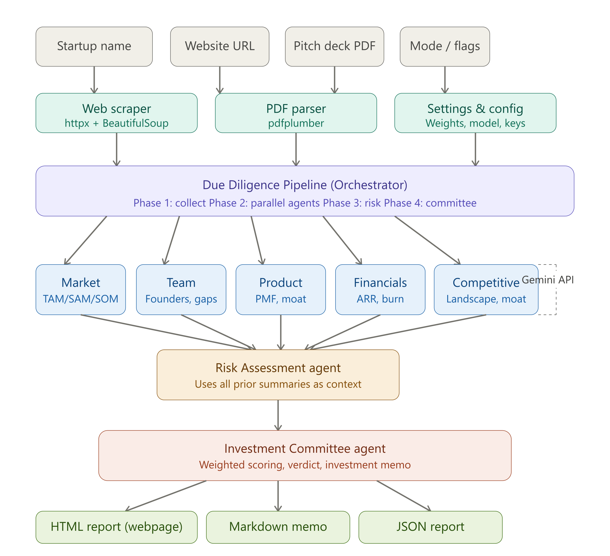
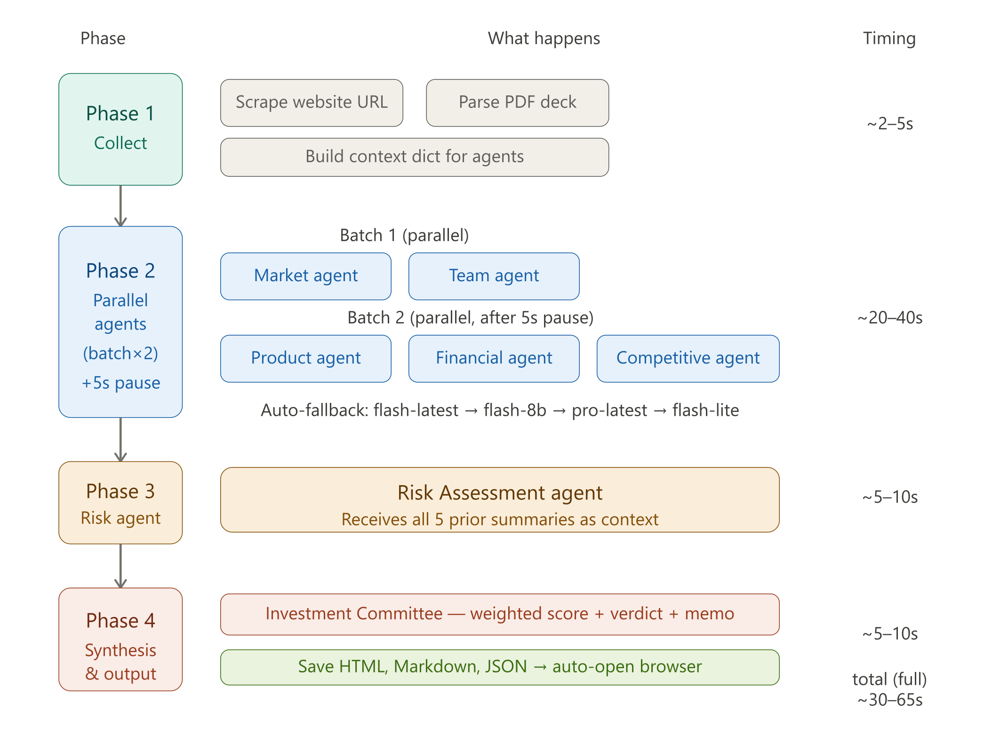

## AI VC Due Diligence Multi-Agent System

> Automating startup evaluation with multi-agent AI pipelines powered by Ollama.

---

## Business Problem

- Venture capital due diligence is time-consuming and requires analyzing multiple dimensions (market, team, product, financials, competition, risk).  
- Human analysts often face information overload from pitch decks, websites, and reports.  
- Existing tools provide fragmented insights without a unified pipeline.  
- Manual evaluation lacks consistency and scalability.  
- There is no single system that combines automated data collection, multi-agent analysis, and structured investment recommendations.

---

## Possible Solution

- Build a multi-agent AI system that automates due diligence across all dimensions.  
- Use Ollama server to run LLMs locally for privacy and scalability.  
- Deploy specialist agents for Market, Team, Product, Financials, and Competition.  
- Orchestrate agents via a pipeline that collects data, runs parallel analysis, evaluates risk, and produces a final verdict.  
- Generate structured dashboards and reports with scores, insights, and investment recommendations.  

---

## Implemented Solution

- Input sources: Startup name, website URL, pitch deck PDF, and configuration flags.  
- Tools: Web scraper (httpx + BeautifulSoup), PDF parser (pdfplumber), and settings manager.  
- Orchestrator: Due Diligence Pipeline with phases — Collect → Parallel Agents → Risk Evaluation → Committee Verdict.  
- Agents:  
  - Market (TAM/SAM/SOM)  
  - Team (founders, gaps)  
  - Product (PMF, moat)  
  - Financials (ARR, burn)  
  - Competitive (landscape, moat)  
- Risk agent aggregates all outputs and feeds into a committee agent for final scoring.  
- Output: Interactive dashboard with scores, AI insights, and investment verdict (Invest / Pass).  

---

## Tech Stack

**Frontend**  
- HTML5, CSS3, JavaScript for dashboard UI  

**Backend**  
- Python (FastAPI) for orchestrator and API server  
- LangGraph for agent routing and state machine  
- Ollama server for running LLM models locally  
- Docker + docker-compose for containerized deployment  

**AI / LLM**  
- Ollama with LLaMA 3.3 70B model  
-
**AI / LLM**  
- Ollama with LLaMA 3.3 70B model  
- Multi-agent design (planner, searcher, summarizer, critic, optimizer, report writer)  

**Tools**  
- Web scraping: httpx + BeautifulSoup  
- PDF parsing: pdfplumber  
- Notifications: Pushover integration  

---

## Architecture Diagram

## Pipeleine Execution 

---

## How to Run Locally

### Prerequisites
- Python 3.10+  
- Ollama installed and running locally  
- Docker + docker-compose installed  
- API keys for optional integrations (Pushover, etc.)

### Step 1 — Clone the repo
git clone https://github.com/your-username/ai-vc-due-diligence.git
cd ai-vc-due-diligence
### Step 2 — Set up environment
bash
cp .env.example .env
Add your Ollama model name and API keys inside .env.
### Step 3 — Start backend
bash
docker-compose up --build
Step 4 — Access dashboard
Open in browser:
Code
http://localhost:8000

### References & Resources

Ollama Documentation — https://ollama.ai

LangGraph — https://github.com/langchain-ai/langgraph (github.com in Bing)

FastAPI — https://fastapi.tiangolo.com

BeautifulSoup — https://www.crummy.com/software/BeautifulSoup (crummy.com in Bing)

pdfplumber — https://github.com/jsvine/pdfplumber

Docker — https://docs.docker.com

### Screen Recording
[Click here to watch Execution](https://drive.google.com/file/d/1JQPSCupoQVVQ1i8PTMPoNT6AC2ZXmlGc/view?usp=sharing)

### Screenshots
Dashboard — Startup input and analysis results
.png)

Agent outputs — Market, Team, Product, Financials, Competition
.png)
.png)
.png)
.png)
.png)

Final Verdict — Investment recommendation
.png)

### Problems Faced & Solutions
1. Model integration issues

    Problem: Initial Groq API setup was deprecated.

    Solution: Migrated to Ollama server for local inference.

2. Large pitch deck parsing

    Problem: PDF files exceeded token limits.

    Solution: Implemented smart text chunking with pdfplumber.

3. Agent coordination errors

    Problem: Agents produced inconsistent outputs.

    Solution: Added critic + optimizer loop for refinement.

4. Environment misconfiguration

   Problem: .env file not loaded correctly.

   Solution: Standardized .env.example template and Docker secrets.

5. Notification failures

   Problem: Pushover alerts not triggered.
   
   Solution: Debugged API keys and added retry logic.